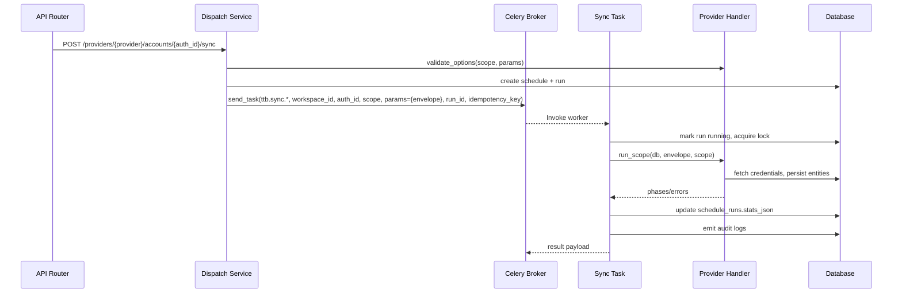

# Provider Registry & Envelope v1

## Overview
The provider registry abstracts sync backends behind a pluggable interface. Dispatchers resolve a provider ID to a handler implementation, normalise options, and enqueue Celery tasks with a consistent signature. Every task reads a versioned *envelope* payload to obtain provider metadata, options, and scheduling identifiers.

## Envelope v1
The envelope is stored under `params.envelope` for every `ttb.sync.*` Celery task. All handlers MUST consume data from the envelope rather than Celery kwargs.

```json
{
  "envelope_version": 1,
  "provider": "tiktok-business",
  "scope": "all | bc | advertisers | shops | products",
  "workspace_id": 42,
  "auth_id": 7,
  "options": {
    "mode": "incremental | full",
    "limit": 200,
    "product_limit": 2000,
    "since": "ISO8601",
    "shop_id": "optional"
  },
  "meta": {
    "run_id": 1234,
    "schedule_id": 5678,
    "idempotency_key": "abc123"
  }
}
```

### Field notes
| Field | Description |
|-------|-------------|
| `envelope_version` | Allows non-breaking upgrades. Tasks currently accept `1` only. |
| `provider` | Registry lookup key (e.g. `tiktok-business`). |
| `scope` | Sync scope (single resource or `all`). |
| `workspace_id` / `auth_id` | Binding identity, used for locking and policy evaluation. |
| `options` | Provider specific runtime options validated at dispatch time. Missing keys are omitted. |
| `meta.run_id` | Schedule run primary key. Tasks fetch and update `schedule_runs` via this identifier. |
| `meta.idempotency_key` | Used for idempotency lookup and retry audit logging. |
| `meta.schedule_id` | Optional helper for audit trails. |

## ProviderRegistry
The registry lives in `app/services/provider_registry.py`.

* `register(provider_id, handler)` – registers a handler implementing `validate_options` and `run_scope`.
* `get(provider_id)` – returns the handler or raises `KeyError`.
* `list()` – introspection helper used by diagnostics.

`app/services/providers/__init__.py` exposes `builtin_providers(registry)` so application bootstrap can register first-party handlers exactly once. Celery tasks and the dispatch layer invoke `load_builtin_providers()` to guarantee registration before use.

### Handler contract
Handlers implement:

1. `validate_options(scope, options)` – return a sanitised options dict or raise `ValueError` for invalid input.
2. `run_scope(db, envelope, scope, logger)` – execute the scope, returning structured `phases` data (and optional `errors`). When a sub-step fails, handlers raise `ProviderExecutionError(stage, original, phases)` to surface partial progress to the task runtime.

## Runtime flow


## Stats JSON contract
Each `schedule_runs.stats_json` entry now follows:

```json
{
  "requested": {
    "provider": "tiktok-business",
    "auth_id": 7,
    "scope": "all",
    "options": {"mode": "incremental", "limit": 200},
    "actor": {"user_id": 1, "workspace_id": 42, "ip": "203.0.113.10"},
    "idempotency_key": "abc123"
  },
  "processed": {
    "counts": {"bc": {"fetched": 10, "upserts": 9, "skipped": 1}},
    "summary": {"bc_count": 9, "partial": false},
    "cursors": {"bc": {"last_rev": "123"}},
    "timings": {"total_ms": 8500, "phases": {"bc": {"duration_ms": 1200}}}
  },
  "errors": []
}
```

Tasks always populate `processed` (possibly empty), and append detailed errors with `{stage, code, message, status}` when failures occur.

## Common error patterns
| Error | Cause | Mitigation |
|-------|-------|------------|
| `lock_not_acquired` | Binding already has a running sync. | Retry after existing job finishes. |
| `ProviderExecutionError` | Handler reported partial failure; run marked as success with `processed.summary.partial=true`. | Inspect `errors` array in `stats_json` for stage + message. |
| `policy denied` | Platform policy engine returned `allowed=False` with enforce mode. | Update policy configuration or retry once limits are relaxed. |
| `missing params.envelope` | Legacy payload detected. | Ensure dispatch layer upgraded to Envelope v1 before invoking tasks. |

## Troubleshooting checklist
1. Inspect `schedule_runs.stats_json` for `requested` and `processed` payloads.
2. Confirm structured logs include `provider`, `scope`, `workspace_id`, `auth_id`, `run_id` for correlation.
3. Validate provider bindings via `GET /api/v1/tenants/{workspace_id}/providers` before triggering a sync.
